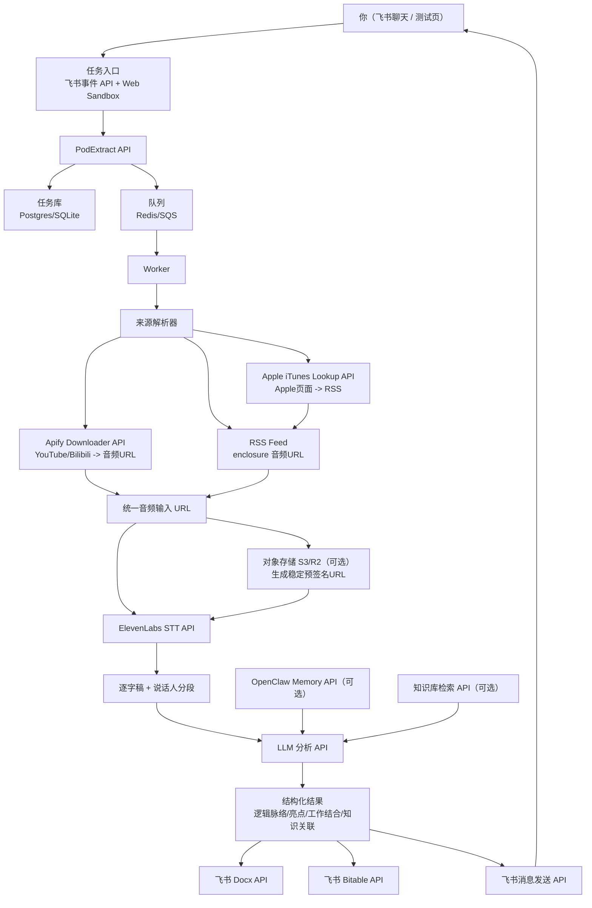

# PodExtract 竖向业务流程图

```mermaid
flowchart TD
  U["你（飞书聊天 / 测试页）"] --> IN["任务入口\n飞书事件 API + Web Sandbox"]
  IN --> API["PodExtract API"]
  API --> DB["任务库\nPostgres/SQLite"]
  API --> Q["队列\nRedis/SQS"]
  Q --> WK["Worker"]

  WK --> SR["来源解析器"]
  SR --> AP["Apify Downloader API\nYouTube/Bilibili -> 音频URL"]
  SR --> IT["Apple iTunes Lookup API\nApple页面 -> RSS"]
  SR --> RSS["RSS Feed\nenclosure 音频URL"]

  AP --> AU["统一音频输入 URL"]
  IT --> RSS
  RSS --> AU

  AU --> OSS["对象存储 S3/R2（可选）\n生成稳定预签名URL"]
  AU --> STT["ElevenLabs STT API"]
  OSS --> STT

  STT --> TR["逐字稿 + 说话人分段"]
  TR --> AN["LLM 分析 API"]
  OC["OpenClaw Memory API（可选）"] --> AN
  KB["知识库检索 API（可选）"] --> AN

  AN --> OUT["结构化结果\n逻辑脉络/亮点/工作结合/知识关联"]
  OUT --> DOC["飞书 Docx API"]
  OUT --> BT["飞书 Bitable API"]
  OUT --> MSG["飞书消息发送 API"]
  MSG --> U
```
